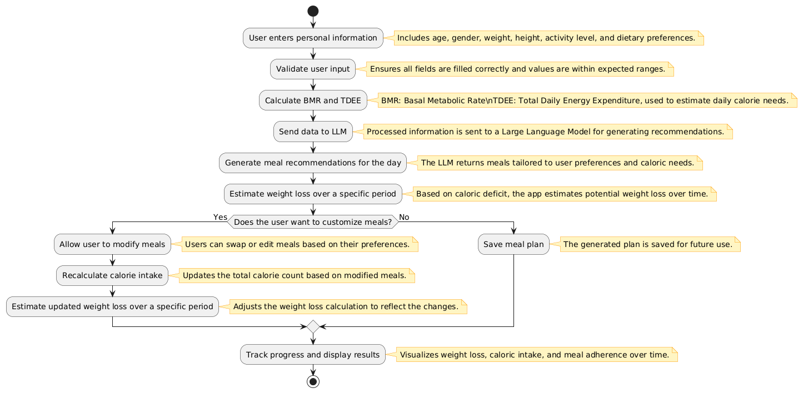

# Nutrition App Pipeline

---

## Pipeline Diagram

---

## Overview
The Nutrition App is a comprehensive system designed to provide personalized meal recommendations based on user input. It calculates the expected weight loss over a specified period and allows users to customize meals while tracking calorie intake.

---

## Features
1. **User Input:**
   - Collects information such as age, gender, weight, height, activity level, and dietary preferences.

2. **Personalized Meal Recommendations:**
   - Utilizes a Large Language Model (LLM) to generate daily meal plans tailored to user goals and preferences.

3. **Weight Loss Calculation:**
   - Estimates weight loss if the user follows the recommendations for a specific period.

4. **Meal Customization:**
   - Allows users to change suggested meals.
   - Recalculates calorie intake for modified meals.

5. **Calorie Tracking:**
   - Tracks the caloric value of each meal and the entire daily intake.

---

## Pipeline

### 1. User Information Input
- **Data Collected:**
  - Age
  - Gender
  - Weight
  - Height
  - Activity Level
  - Dietary Preferences

### 2. Data Processing
- Validates user input.
- Calculates Basal Metabolic Rate (BMR).
- Estimates Total Daily Energy Expenditure (TDEE).

### 3. Meal Plan Generation
- Sends processed user data to an LLM.
- Receives daily meal recommendations tailored to user preferences and caloric needs.

### 4. Weight Loss Estimation
- Based on caloric deficit:
  - Calculates potential weight loss over a chosen period.

### 5. Customization and Calorie Recalculation
- Allows users to modify meals.
- Recalculates total daily calorie intake after changes.

---

## Progress Tracker
Click on the boxes to mark tasks as completed.

- [ ] User Information Input
- [ ] Data Processing
- [ ] Meal Plan Generation
- [ ] Weight Loss Estimation
- [ ] Customization and Calorie Recalculation

---

## Base Repositories

| Repository Name | URL |
|-----------------|-----|
| LLM4REC         | [https://github.com/anord-wang/LLM4REC.git](https://github.com/anord-wang/LLM4REC.git) |

---

## References

| Reference | URL |
|-----------|-----|
| LLM4Rec Awesome Papers | [https://github.com/WLiK/LLM4Rec-Awesome-Papers](https://github.com/WLiK/LLM4Rec-Awesome-Papers) |
